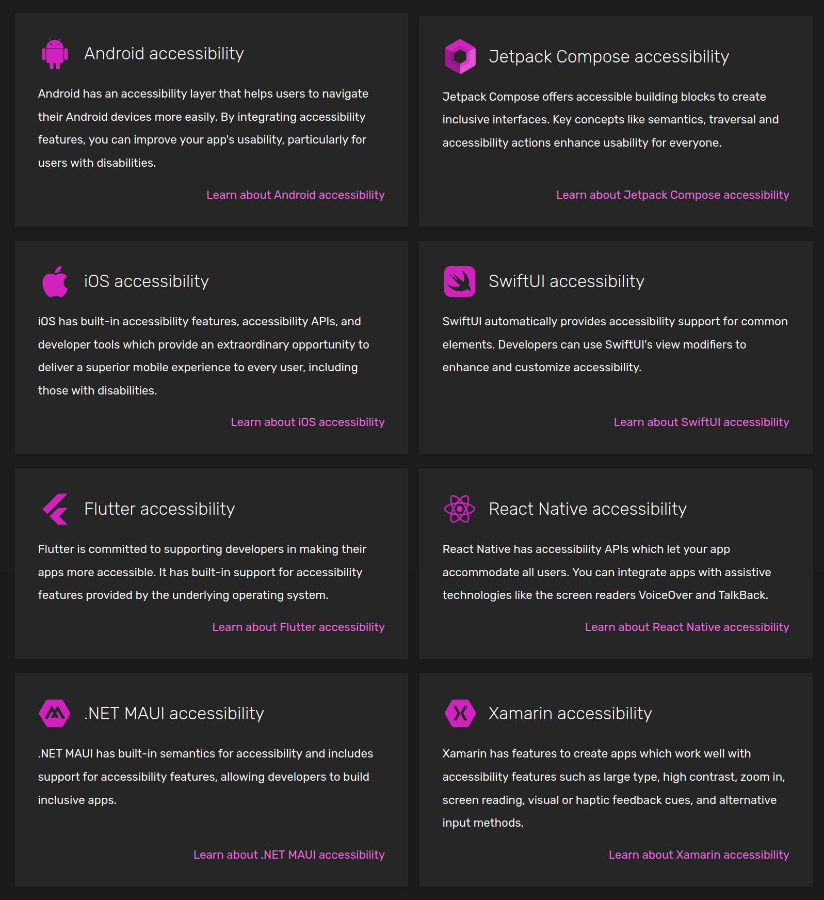
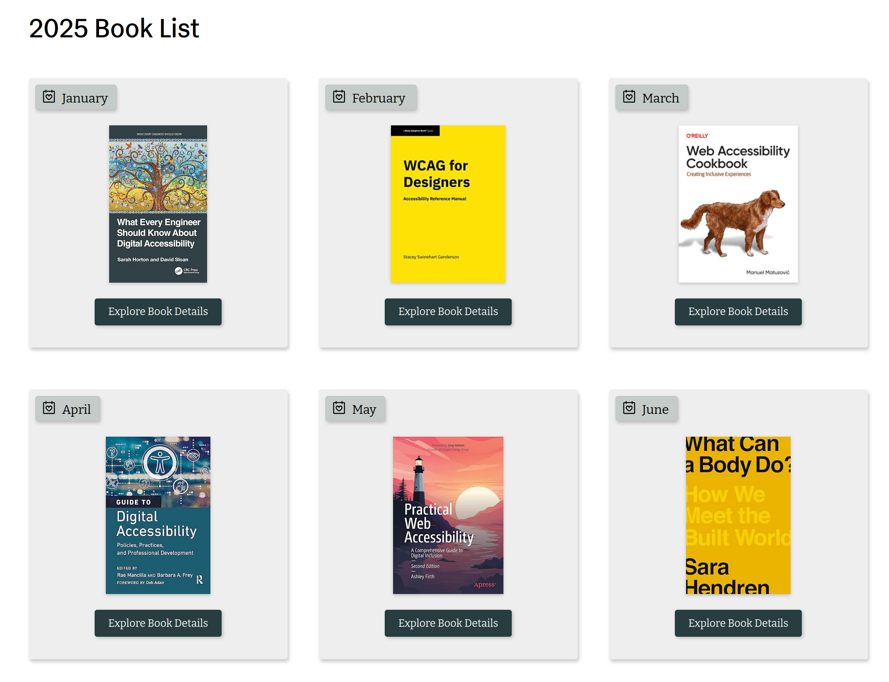

# 🗺️ A-BCT Brief cartography of today’s accessibility landscape

!!! Info "In this module"
    We will cover the main actors of today's accessibility landscape as well as their dynamics.

**⛳️ Section**: A. What is accessibility ?

**👥 Audience**: Everyone

**⏱️ ️Duration**: 10'

**📚 Prerequisites**: [👩‍🦽 A-AIE: Accessibility & Ableism](A-AIE.md)

---

# When to use ?

This module is useful as an introduction to understand what are the current dynamics in the accessibility landscape, what actors are considered as reference, and which ones are disregarded by most experts.

## Disclaimer

We -the original authors- are not experts by any mean, only engineers working on accessibility and inclusiveness trying to provide others with the resources we wished we had. We don't have a complete understanding of all stakes in the accessibility landscape. Keep in mind that the following cartography will certainly be missing some precisions. If you want to help completing it with your own knowledge, feel free to contact us or to open a pull request on [our repository](https://github.com/Page-and-Maxence/building-inclusive-open-source-software).

# The actors of accessibility

The actors can be separated in four main categories: the publics actors, non-profit collectives, consulting firms, small companies (including start-ups) and bigger corporate actors. We could also mention university's researchers - but this would probably turn this module into a full state-of-the art bibliography.

## Publics actors
TODO
### States
TODO
### European union
TODO
## Non-profit collectives

Non-profit organizations are at the core of producing resources about accessibility and inclusiveness, especially from a design and platform agnostic perspective. They are also a great sources for critical subjects on the current state of accessibility for different platforms as they often have less conflicts of interest.

### The World Wide Web Consortium (W3C)

The [World Wide Web Consortium](https://www.w3.org/about/) is the organization behind multiple accessibility guidelines and standards recognized worldwide. With over 30 years of existence, it's mostly known for its work on the WCAG which are the worldwide standards in term of web accessibility.

They also created and updated a very extensive documentation on how to meet those standards with their [Quick Reference on How to Meet WCAG](https://www.w3.org/WAI/WCAG22/quickref/). They are definitely one of the most important organizations providing resources on accessibility.

**They have full time employees but also rely on volunteers contributions, so if you want to help them, [go ahead](https://www.w3.org/get-involved/)!**

Sadly, despite the amazing work that they do on accessibility, they still lack diversity. They are trying to do better on this topic, providing [yearly detailed statistics of their diversity](https://www.w3.org/about/diversity/diversity-report-2024/) for their Advisory board, technical architecture group, board of directors and management. We can notice that their inclusiveness seems to improve over time.

### The Appt Foundation

The Appt foundation is a non-profit organization started in the netherlands that specialize on mobile applicative accessibility. It doesn't have employees but work with experts and industrial partners. They have multiple extensive documentations including code samples about accessibility for mobile frameworks that are often way clearer than the official ones.

It's definitely a very useful resource if they have documentation for the framework you are working with. You can contribute on [their repository](https://github.com/appt-org/appt-website).

### The A11Y Project

The A11Y Project mostly focuses on web accessibility but isn't limited to it, also hosting a very extensive and useful list of resources. Their posts are informative. They have a "spotlight" section which is useful to get to know the contributions of amazing people working on software accessibility. Most importantly, their list of medias is well furnished with [dozen of carefully selected resources](https://www.a11yproject.com/resources/). **We strongly invite you to take a look at it.**

### The Accessibility Book Club

The Accessibility Book club is a small organization releasing a [yearly book list about accessibility](https://www.a11ybookclub.com/annual-book-lists). Their selection is a very useful tool to stay up to date with the developments of the accessibility and inclusiveness publications.

## Consulting firms

There are many consulting firms about accessibility and inclusiveness. The quality of their services vary greatly in quality. Therefore we won't be recommending much of them as we cannot certify of the expertise of structures we haven't directly worked with.

### Deque

While we cannot blindly recommend firms, Deque is an actor of the accessibility landscape that we need to mention. They built [Axe](https://www.deque.com/axe/auditor/) which is one of the most trusted web accessibility tool with over two billion downloads. Additionally, they are behind the accessibility of some of the biggest companies worldwide (working with Google, Microsoft and other large structures) and publish very relevant books on the topic. If you are looking for training, tools or an audit, you should consider their expertise.

## Corporate actors

Corporate actors and especially operating system providers can take an important role in accessibility and inclusiveness measures, either by their good or their bad will.

### Apple
TODO
### Microsoft
TODO:
* Microsoft Inclusiveness website
* Windows recall and the issues it create for accessibility (ex of signal)

### Orange
TODO
# What to look for and what to avoid

## Accessibility and AI powered tools

If you search for some accessibility tools online, it's very probable that the first sponsored results to pop up will be something like *"Automated Web Accessibility Solution"*, often powered by AI. Those solutions are largely criticized by accessibility experts. In an open letter signed by more han 400 accessibility advocates, we can read:

!!!quote "Sarah Gooding, *[Accessibility Advocates Sign Open Letter Urging People Not To Use AccesiBe and Other Overlay Products](https://wptavern.com/accessibility-advocates-sign-open-letter-urging-people-not-to-use-accesibe-and-other-overlay-products)*. 2021"
    1. We will never advocate, recommend, or integrate an overlay which deceptively markets itself as providing automated compliance with laws or standards.
    2. We will always advocate for the remediation of accessibility issues at the source of the original error.
    3. We will refuse to stay silent when overlay vendors use deception to market their products.
    4. More specifically, we hereby advocate for the removal of accessiBe, AudioEye, UserWay, User1st, MK-Sense, MaxAccess, FACIL’iti, and all similar products and encourage the site owners who’ve implemented these products to use more robust, independent, and permanent strategies to making their sites more accessible.

Accessibility needs to be baked into an application from the very beginning. And while some work can be done to make existing interfaces more accessible, **there is no magic band-aid fix that will make your app accessible**. Indeed, accessibility is all about nuance, context and diverse user feedback. Trying to automate its whole process is paradoxical. Doing so will only result in your app striving to match arbitrary accessibility rulesets when the whole point is to embrace diversity and the uniqueness of ways to interact with a UI. **The rulesets, rather than being a tool to guide you, becomes the goal, effectively silencing disabled users.** Relying on those tools doesn't make your app usable for a disabled user. It will simply make sure no failure is triggered when running an automated test. Its lack of context will often lead them to the implementation of confusing and non-usable solutions.

!!! Tip
    **Accessibility is not a goal, it's a process. A process which cannot be done without disabled users and experts.**

## Green and red flags for choosing accessibility experts

The previous section should help you what to avoid, but what qualities should you be looking for when choosing experts ?

!!! success "Look for..."
    * Structures that have disabled experts or value directly working with disabled people
    * Structures that talk about inclusiveness rather than accessibility alone
    * Structures that provide transparency about their own diversity distribution

!!! Failure "Avoid..."
    * Automated accessibility overlay products
    * Products that claims to have automated AI accessibility fixes
    * Promises of quick fixes
    * Structures that delivers a one time accessibility enhancement without maintenance or knowledge transmission to your team

# Sources

[Sarah Gooding, *Accessibility Advocates Sign Open Letter Urging People Not To Use AccesiBe and Other Overlay Products*. 2021](https://wptavern.com/accessibility-advocates-sign-open-letter-urging-people-not-to-use-accesibe-and-other-overlay-products)