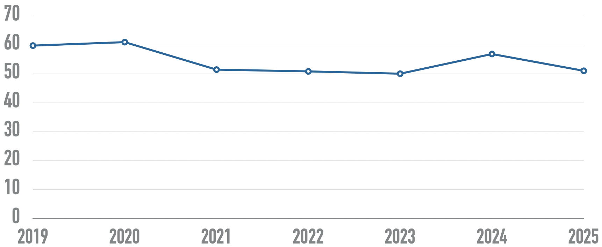
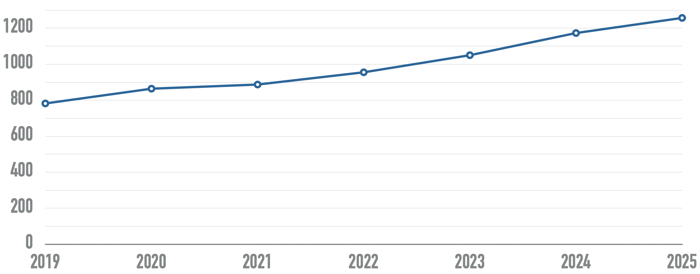
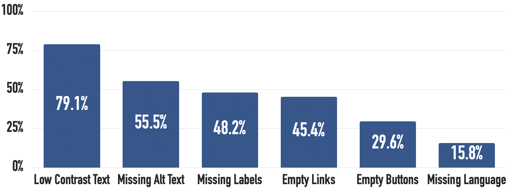

# 🫳🏿 A-FNA: Feeling the need for accessibility

!!! Info "In this module"
    Sometimes, understanding a concept is not enough.
    Feeling the need for accessibility and the impacts of ableism will make it easier
    for trainees to engage.

**⛳️ Section**: A. What is accessibility?

**👥 Audience**: Everyone

**⏱️ ️Duration**: 15'

**📚 Prerequisites**: A-ASP: Accessibility starting point

---

## When to use?

This module gives both a statistical overview of accessibility, the opportunity to experience the need of its presence and how dreadful its absence can be.

## Introduction

Accessibility is absolutely crucial. In fact, [according to a study from Statistics Canada](https://www150.statcan.gc.ca/n1/pub/11-627-m/11-627-m2023063-eng.htm), 27% of all Canadians have at least one disability. This number increased of 4.7 percentage points between 2017 and 2022.

More globally, according to the [World Health Organization](https://www.who.int/health-topics/disability#tab=tab_1), 16% of the world’s population experience significant disability.

While disabilities and their experiences are varied and overlap each other, letting the trainees try their application with a screen reader can be a good starting experiment for you to get a sense of how crucial it is.

## Try it out!

On different platforms, taking turns, each participant is put in front of a device connected to a screen in their back. All the trainees can see the application’s screen but the one using it.

They must then try to execute a task like changing a specific setting or writing a message to a contact, without seeing the app nor using a mouse. At the end of this small workshop, they are invited to debrief on how they felt and what the main blockers were.

!!! Tip
    On an application that recently had strong accessibility improvements, this experience can me made twice: firstly with the now fairly accessible version and then with the old one.

## The systemic failure of software accessibility

This section will mainly be based on the the [WebAIM Million 2025 report on the accessibility of the top 1,000,000 home pages](https://webaim.org/projects/million/). It only includes web pages, but as we will see later, resources about the state of desktop and mobile accessibility are few. We can make the hypothesis that while not completely similar, both web pages and applications must be navigated with the same assistive technologies, and therefore share similar trends of evolution.

[The WebAIM collective states that](https://webaim.org/projects/million/) “**Across the one million home pages, 50,960,288 distinct accessibility errors were detected—an average of 51 errors per page”.**

Their graph depict the evolution of the average number of detectable errors for home pages.  Failures typically include missing labels, low contrast text or missing alternative captions for images.

Home pages tend to get more and more complex. While some websites are getting more accessible, those who don’t tackle the issue tend to get even worse. Examples of greatly accessible websites are rare. Indeed, “**94.8% of home pages had detected [WCAG 2](https://webaim.org/standards/wcag/checklist) failures.”**

On this graph coming from the same study, you can see the evolution of the number of elements on home pages has been increasingly steadily over the past few years.

You might be wondering, what are the most common accessibility shortcomings detected? This chart is a good starting point to tackle the most obvious issues that our applications and websites might have.

## Wrapping up

As we saw through this module, despite being a crucial need for at least 20% of all users, accessibility as it is implemented on common websites and applications are overwhelmingly insufficient. With that said, accessibility isn’t about lowering those stats of detected failures, it’s about making sure that we are not contributing in isolating and marginalizing whole communities.

Until now, we only mentioned accessibility and disability as vague concepts, but understanding and feeling what they mean conceptually is key to concretely improve your software.

So… what exactly is accessibility?

## Sources

[WebAIM: The WebAIM Million - The 2025 report on the accessibility of the top 1,000,000 home pages](https://webaim.org/projects/million/)

[Word health Organisation: Disability](https://www.who.int/health-topics/disability#tab=tab_1)

[New data on disability in Canada, 2022](https://www150.statcan.gc.ca/n1/pub/11-627-m/11-627-m2023063-eng.htm)