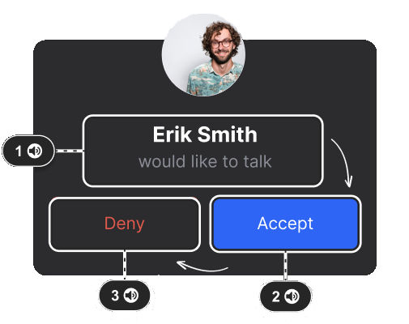

# 🔭 Inclusive needs overview

!!! Info "In this module"
    This module aims at giving the trainees an overview of the most common various accessibility needs their users could have.

**⛳️ Section**: B. From accessibility to inclusiveness

**👥 Audience**: Everyone

**⏱️ ️Duration**: 15'

**📚 Prerequisites**: [🫂 We are all disabled and unique : accessibility, plurality and intersectionality](B-WDU.md)

---

## When to use

This module should be used when already having a basis of what accessibility and inclusiveness means as well as how they interact together. It should help trainees have more concrete examples of what working on accessibility will mean technically.

## Main disabilities to account for in softwares

The list of disabilities are the main ones you will need to directly take into account for software development. It is evidently non-exhaustive. Keep in mind that disability is not a binary state but rather represent a wide variety of living experiences and that a lot of users will have multiple disabilities at once.

### Low vision

Visual impairment affects up to 17% of users [according to Microsoft](https://learn.microsoft.com/en-us/windows/win32/uxguide/inter-accessibility). Therefore, you will need to make your application usable with assistive technologies like screen-readers or braille displays as well as a keyboard alone.

Here is an example of navigation between elements providing feedback to an assistive technology like a screen reader.

<figure markdown="span">
    
</figure>

Hopefully, because of the way OS and frameworks function, making an app accessible to one assistive technology should make it mostly accessible to others. This will probably be one of the thing that will take you the most time accessibility-wise.

### Deafness

18% of users are hearing-impaired [according to Microsoft](https://learn.microsoft.com/en-us/windows/win32/uxguide/inter-accessibility). For more specific informations on their needs, you can check the [How to Meet WCAG (Quick Reference)](https://www.w3.org/WAI/WCAG22/quickref/#time-based-media) of the W3C. You will mostly need to provide redundant access to all auditive information. This can be for example a visual notification accompanying all sounds or real-time subtitling like the [Whisper Transcript plugin on Jami](https://jami.net/plugins/).

### Motion sickness

Some users will experience motion sickness when presented with fast moving elements. You should be aware of that, providing them with solutions for a less triggering experience. Known triggers include:

- Zooms
- Flashing or blinking
- Animations playing automatically without user interaction
- Parallax effects

### Color blindness

A less evident visual impairment is color blindness. This one relatively straight forward: **make sure your UI doesn't rely on color elements alone to be conveying an information. For example if a colored dot indicate wether a user is connected or not, it should be accompanied by a text label or an icon.

### Cognitive impairment

Cognitive impairments are a key element to be thinking about when designing. Indeed, it affects [16% of users](https://learn.microsoft.com/en-us/windows/win32/uxguide/inter-accessibility). Accessibility can be improved for this demographic by allowing for highly customizable applications and UIs.

In [👩‍🦽 Accessibility & Ableism](A-AIE.md) we saw a quote of Ashley Shew showcasing how Discord became a welcoming place for many autistic people.

!!! Quote "Ashley Shew, *[Against Technoableism, Rethinking Who Needs Improvement](https://wwnorton.com/books/9781324036661)*"
    Awni mentioned Discord as a social platform “easily adapted by autistic users to facilitate autistic-styled communication due to its flexibility both with custom emotes and for purpose-centric server organization.” Gardiner pointed to the importance of letting autistic people lead tech conversations with what they want and how they want to do things. This doesn’t mean jumping in to teach autistic people to play games in the way allistic people do but rather letting the “nothing about us without us” lesson of the disability rights movement carry into this space: to learn from autistic people how to use spaces autistically.

Making a simplified form of your UI can also be a useful feature.

### Motor disabilities

### Speech or language

## Intersectional needs

In the [🎨 Inclusive design 101](C-IDE.md) module we will develop further the intersectional needs to take into account. Before that, a *non-exhaustive* list of human characteristics to keep in mind in order to try and include as many user as possible would be:

- Age
- Culture
- Digital literacy
- Education
- Ethnicity
- Gender, gender identity
- Historical context
- Language
- Mental health
- Nationality
- Physical *and* cognitive (dis)abilities
- Sexuality
- Socio-economic context

!!! tip
    **You need to consider the intersections of all of those categories as well as the disabilities listed previously in the first section of this module.**

Realistically, you cannot predict and account perfectly for all of those characteristics, because they are spectrums rather than fixed labels. The best you can do, is actively seek and listen to feedback from diverse user groups and make sure your team is as diverse as possible.

Some of the tools that we will share later in this training should still help you go through the main accessibility and inclusiveness elements when designing and developing.

## Sources

[Microsoft, *Accessibility (Design basics)*](https://learn.microsoft.com/en-us/windows/win32/uxguide/inter-accessibility)

[W3C, *How to Meet WCAG (Quick Reference)*](https://www.w3.org/WAI/WCAG22/quickref/#time-based-media)