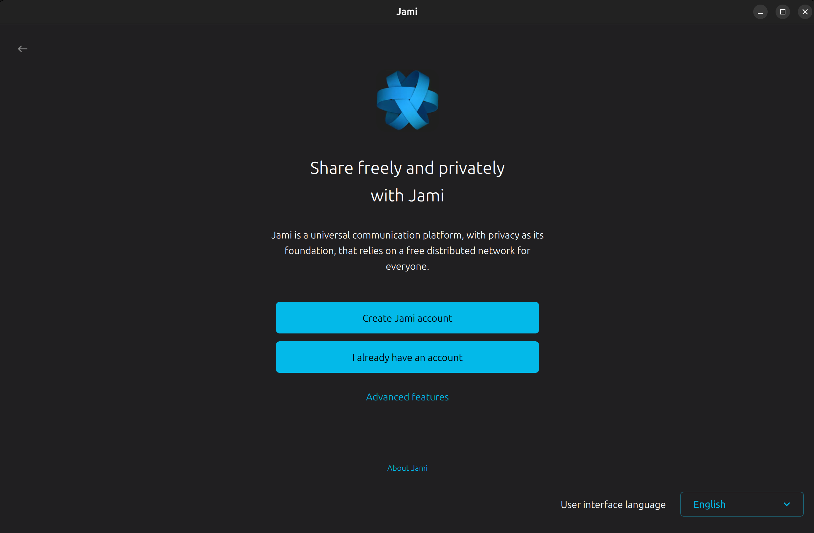
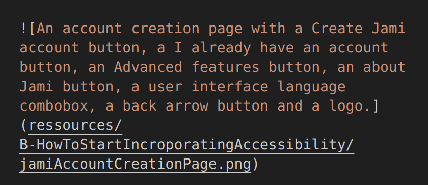

# 🫂 B-WDU We are all disabled and unique : accessibility, plurality and intersectionality

!!! Info "In this module"
    We will explore the concepts of intersectionality and inclusiveness and it’s use in software development

**⛳️ Section**: B. From accessibility to inclusiveness

**👥 Audience**: Designers

**⏱️ ️Duration**: 30'

**📚 Prerequisites**: Accessibility, inclusion & exclusion, We are all disabled and unique

**📖 Is a prerequisite to**: None

---

## When to use ?

This module is necessary to deconstruct the idea that accessibility is merely about designing for users who can't see or hear.

---

## Inclusiveness and co-creation
### Who is disabled ?

Since the beginning of this training, we have been referring to the disabled people in the 3rd person, as if they were "others". The truth is, some of us writing this are disabled, some of you reading this are, as we all will be some day. The barrier between the able-bodied and the disabled is a lot more porous than we could think at first glance.

Many people who think themselves as able-bodied use the zoom feature in order too have bigger text. People who have a hard time using new technology are also a core target for accessibility features, like simplified UI.

The line blurs further once we realize that accessibility features are useful to everybody no matter what. VIM users are the first ones to profit from good keyboard navigation. Many people use subtitles on a daily basis when commuting. Mobile "gesture typing" started out as an accessibility feature.

While this convenience for some is surely necessary for others, we can appreciate that these categories - disabled and able-bodied - are rather arbitrary and that no clear boundary can be drawn.

**Therefore, it's crucial to not think disabled peoples as a minority but rather as the living diversity that we will all become.**

### What is inclusiveness ?

The [Cambridge dictionary](https://dictionary.cambridge.org/dictionary/english/inclusiveness) would define inclusiveness as :
""" Quote "[Cambridge dictionary](https://dictionary.cambridge.org/dictionary/english/inclusiveness)"
    the quality of including many different types of people and treating them all fairly and equally

Inclusiveness is a core concept when talking about diversity. It's often a preferred term to accessibility that is rather limited to the inclusion of people with disabilities. It highlights that we need to be designing and programming not only for accessability but also for the ever-varying pluralities of human experiences and discriminations. **In simpler words, not being ableist is not enough. We must make sure that we are also not perpetuating other kinds of oppressions.** For example, using gender-neutral language and icons when referring to a user, and not having fixed first and last name fields can help people from various backgrounds feel welcome in the space you are creating with your app.

While keeping this in mind represents an important leap in inclusiveness of your product, understanding how discriminations are related to each other is crucial to being inclusive and understand your users. **There is no inclusiveness without intersectionality.** That is why the rest of this module will be dedicated to it.

## Intersectionality and plurality of experiences

### What is intersectionality ?

In [Mapping the Margins: Intersectionality, Identity Politics, and Violence against Women of Color](https://www.jstor.org/stable/1229039), Kimberle Crenshaw defines intersectionality to address an issue she encountered as an jurist in the late 80’s in the US. When filling in cases about discriminations in work environment, lawyers must select the discrimination that their client is facing (for example, racism or sexism).

This is where Crenshaw had a problem: some of her clients were black women, whose cases were dismissed because their employer had hired white women and black men, and therefore could protect themselves from accusations of sexism or racism.

That is why Crenshaw defined intersectionality as a framework for understanding **specific living experiences of people situated at the intersection of discriminations and privileges**. In her case, that was to showcase the specific oppression that black women lived, that could not be explained by sexism and racism. The intersection of the “black” and “women” oppressions produced a new specific one, different of the addition of the two.

### Intersectionality in software

What do we need the concept of intersectionality for in software development ?

It’s actually very useful, for two main reasons !

- The proportion of users with disabilities who happen to have more than one is important ([17.7% in 2016](https://pmc.ncbi.nlm.nih.gov/articles/PMC11545900/)). Thinking about designing for one disability leaves out a blank spot for users having that disability but also other conditions. For example, deaf users with low vision are often overlooked when thinking about accessibility. We will take a closer look at the appropriate stance to account for diversity in [Developer stance & user collaboration](B-DSU.md)

- It’s a common bias to forget that disabled people are not just disabled, but first and foremost people with their own unique life experiences and specificities. We need to think about disabled women, disabled queers, disabled Arabs and those who are all of that at once!

**Certain issues only arise for people with a specific intersectional background.**

Take for example this main account creation page. If you ask someone that you know with vision to test it or do it yourself you probably won't find any issue. Can you guess what kind of users can have trouble with it.

This one was hard and required a lot of intuition. The "user interface language" label and the actual combo box looks like two separate elements, because they are, making them inaccessible as is with keyboard navigation. If you speak a niche language and are low vision you cannot access the combobox to change it to a language that you speak.

Therefore, a low vision, english speaking user will not encounter any issue on this page and might consider it totally accessible while a non-english speaking one will encounter issues navigating it.

This can be fixed by adapting to your system language dynamically.

Another intersectional example is presented to us by Apple in their [The practice of inclusive design](https://developer.apple.com/videos/play/wwdc2021/10275/) video. They encountered this issue when developing a system capable of automatically generate descriptions of images for low vision users using a generative AI models. Can you guess what it is?

*The accessible text of the previous image of this page (the account creation page) as seen in the markdown*

The model generating descriptions had the tendency to assign gender to people on the images it was captioning, therefore regularly misgendering cis, trans and especially non-binary people. This issue encountered by those at the intersection of the low vision and queer community prevented them from affirming their identity and feel welcome.

The solution that Apple chose to adopt was to train their model to concentrate on other elements of an image, like the clothes that a person is wearing, their facial expression or where they are standing. By avoiding oppressive biases, the model ended up being better for all users.

## Sources
[Crenshaw, Kimberle. “Mapping the Margins: Intersectionality, Identity Politics, and Violence against Women of Color.” Stanford Law Review, vol. 43, no. 6, 1991, pp. 1241–99.](https://www.jstor.org/stable/1229039)

[Kohzuki M. Multimorbidity and Multiple Disabilities: Present Status and the Roles of Rehabilitation. J Clin Med. 2024 Oct 23;13(21):6351.](https://pmc.ncbi.nlm.nih.gov/articles/PMC11545900/)

[Apple. "The practice of inclusive design". Accessed the 17 July 2025](https://developer.apple.com/videos/play/wwdc2021/10275/)

[Cambridge's dictionary's definition of inclusiveness](https://dictionary.cambridge.org/dictionary/english/inclusiveness)

