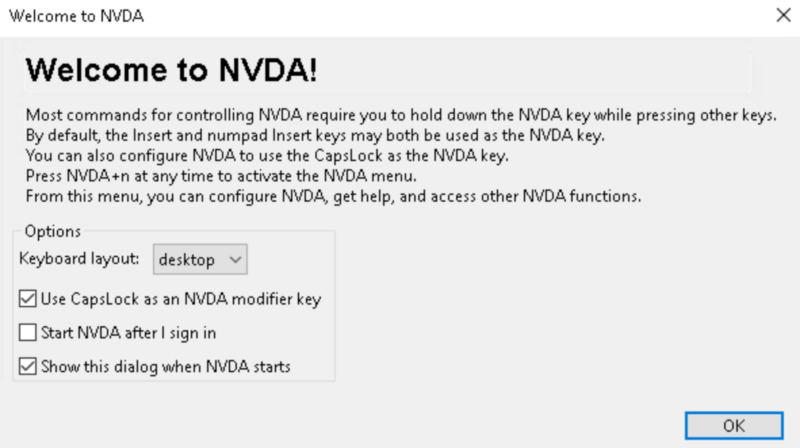
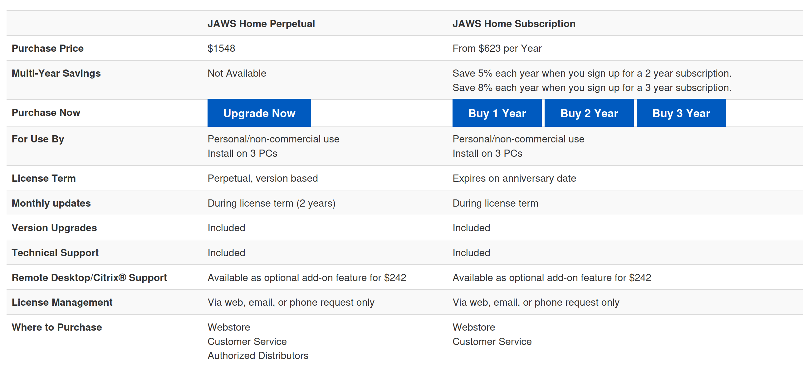
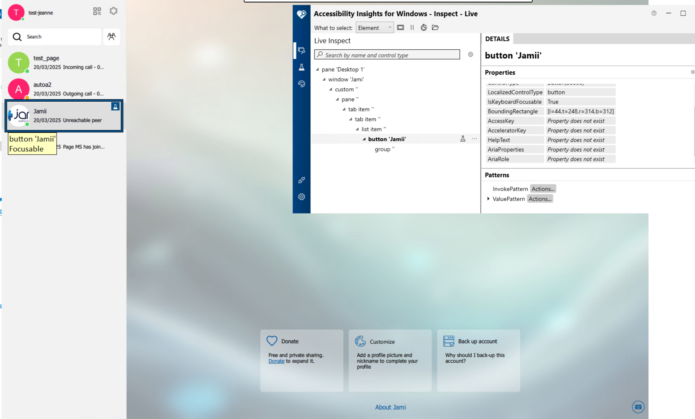
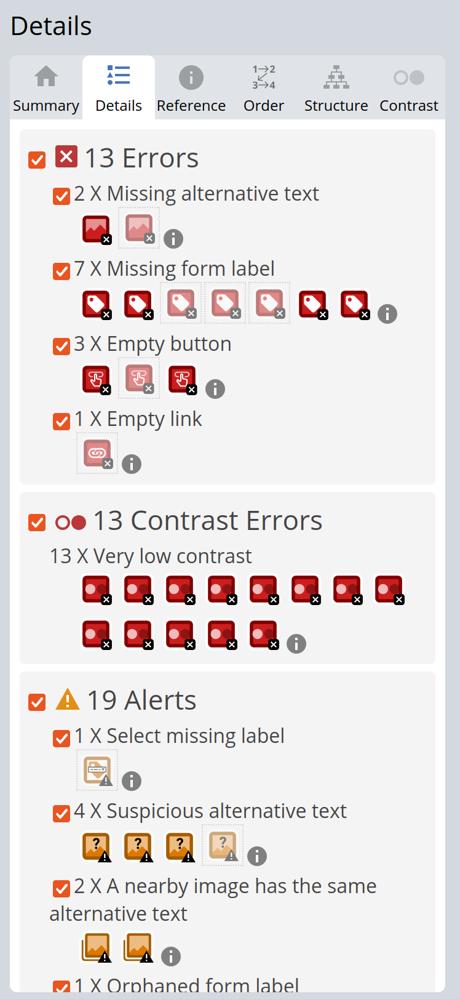

# 🔧 E-ITD Inclusiveness technologies : Desktop

!!! Info "In this module"
    This module gives a comprehensive list of accessibility testing tools (both
    manual and autonomous). The goal is not to get in depth on how to use them
    but rather to help designers and developers to find the relevant tools for
    their use case.

**⛳️ Section**: D. Programming inclusive and accessible software

**👥 Audience**: Developers

**⏱️ ️Duration**: 15'

**📚 Prerequisites**: [👩‍💻 D-ICO Inclusive code 101](D-ICO.md)

---

# When to use ?

This module is almost certainly a must have for an type of workers searching for the adequate tools.

## What to avoid

As we saw in [🗺️ A-BCT Brief cartography of today’s accessibility landscape](A-BCT.md), some tools are really despised by accessibility and inclusiveness experts and with valid reasons. We could summarize by saying: **stay away from AI accessibility tools**. They are often more detrimental than anything. Accessibility is really hard to automate specifically because it's about embracing diversity and learning from other's needs. Using AI tools could make you technically compliant with some legislation (for example filling all of the empty labels on your application) but it won't make your application usable by people with disabilities.

The errors automaticly detected highly depends of context (for example a long accessibility label is not necessarily a bad thing if attached to a schematic but will be flagged automaticly as an issue). Furthermore, the fixes are often clunky, unintuitive and don't take the specific of the application architecture into account.

> **Disabled people are the expert about accessibility. Listen to them, not to an AI trying to predict their needs.**

## A screen reader and a keyboard

Screen readers are very useful tools to test the accessibility of an application. While it does not fullfill the need of testing by users in question, apps that are fully accessible using a keyboard and a screen reader are more likely to address a good amount of accessibility needs.

A good and simple practice is to **always check** if your modifications on the UI are **fully accessible only with your keyboard** — not a challenge for our beloved vim users.

You can find more information in this very informative video:

<iframe src="https://www.youtube.com/watch?v=yV_ENQZq3fs&t=418s"
        title="Accessibility Testing Tools Overview" frameborder="0" allowfullscreen
        allow="accelerometer; autoplay; clipboard-write; encrypted-media; gyroscope; picture-in-picture"
        style="position: absolute; width: 100%; height: 100%;">
</iframe>

You may also find this comparison of screen readers helpful:

<iframe src="https://www.youtube.com/watch?v=9_K5-4ngDtE"
        title="Screen Reader Comparison" frameborder="0" allowfullscreen
        allow="accelerometer; autoplay; clipboard-write; encrypted-media; gyroscope; picture-in-picture"
        style="position: absolute; width: 100%; height: 100%;">
</iframe>

Most systems have a built-in screen reader in their settings,  you should use them to test your app but don't limit yourself to them as they are often pretty basic. Most screen readers have plugins for the most used apps. If you have the available resources, you might want to develop one for your app specifically.

### NVDA

<table>
        <thead>
                <tr>
                        <th>Platform</th>
                        <th>Pros</th>
                        <th>Cons</th>
                </tr>
        </thead>
        <tbody>
                <tr>
                        <td>Windows Theoretically Linux (via Wine)</td>
                        <td>
                                <ul>
                                        <li>Free and open source</li>
                                        <li>Very lightweight</li>
                                        <li>Doesn't crash much</li>
                                </ul>
                        </td>
                        <td>
                                <ul>
                                        <li>Plugins for major productivity apps are often not as robust as JAWS</li>
                                </ul>
                        </td>
                </tr>
        </tbody>
</table>

[NVDA](https://www.nvaccess.org/download/) is open source and mainly available on Windows (you can still run it on Linux using Wine but it will inconsistently work). It's free and therefore is a very good tool to start testing accessibility. One of it's key advantage is that it's very lightweight meaning that it starts a lot faster that other screen readers which can make all the difference when those softwares are known to crash easily. It's still a bit limited on some complex applications like Excel.

It still has an active community developing plugins for integrating it into different apps. Consider doing it for yours!

You can easily find a [complete list of shortcuts for NVDA](https://dequeuniversity.com/screenreaders/nvda-keyboard-shortcuts).

### Jaws

<table>
        <thead>
                <tr>
                        <th>Platform</th>
                        <th>Pros</th>
                        <th>Cons</th>
                </tr>
        </thead>
        <tbody>
                <tr>
                        <td>Windows</td>
                        <td>
                                <ul>
                                        <li>Industry standard</li>
                                        <li>Has a lot of plugins</li>
                                </ul>
                        </td>
                        <td>
                                <ul>
                                        <li>Crashes a lot</li>
                                        <li>Requires a lot of RAM</li>
                                        <li>Very expensive</li>
                                        <li>Hard to learn</li>
                                        <li>Can be confusing</li>
                                </ul>
                        </td>
                </tr>
        </tbody>
</table>

[Jaws](https://www.freedomscientific.com/products/software/jaws/) is is the high end professional screen reader. It allows for a lot of customization, has a lot of plugins especially for higher education. That said, it can be overwhelming, crashes for seemingly no reason, it’s not open source and more importantly a license will cost you more than 600$ a year…

That's why we recommend NVDA.

### VoiceOver for macOS

<table>
        <thead>
                <tr>
                        <th>Platform</th>
                        <th>Pros</th>
                        <th>Cons</th>
                </tr>
        </thead>
        <tbody>
                <tr>
                        <td>macOS</td>
                        <td>
                                <ul>
                                        <li>Very easy to learn</li>
                                        <li>Very fluid and intuitive</li>
                                </ul>
                        </td>
                        <td>
                                <ul>
                                        <li>Only available on macOS</li>
                                </ul>
                        </td>
                </tr>
        </tbody>
</table>

[VoiceOver](https://www.apple.com/voiceover/info/guide/_1121.html) is the native screen reader for Apple products. It's known for being very  easy to learn making for a fluid and intuitive experience. In the screen reader comparison linked previously in this article, the user state that learning Jaws took them years compared to the week-end it took them to get used to VoiceOver.

While being a very good, Voice Over is only available on apple machines and therefore often not useful to most users.

---

## Accessibility Insights for Windows

<table>
        <thead>
                <tr>
                        <th>Platform</th>
                        <th>Pros</th>
                        <th>Cons</th>
                </tr>
        </thead>
        <tbody>
                <tr>
                        <td>Windows</td>
                        <td>
                                <ul>
                                        <li>One of the only tools available to check object tree and labels on desktop apps</li>
                                </ul>
                        </td>
                        <td>
                                <ul>
                                        <li>Only works on Windows</li>
                                        <li>Doesn’t provide much information about how to fix the issue encountered</li>
                                </ul>
                        </td>
                </tr>
        </tbody>
</table>

[Accessibility Insights for Windows](https://accessibilityinsights.io/) is a tool developed by Microsoft. It aims at visualizing the object hierarchy of an application. It’s a must have for diagnosis of missing labels and understanding where property hierarchy is broken.

Here you can see an example of a poorly described object tree in Jami.

    ❕ An empty label is not always a bad thing depending of the framework that you
    are using. It can sometimes be useful to not register too many ID accessible as
    singletons.

---

## Wave

<table>
        <thead>
                <tr>
                        <th>Platform</th>
                        <th>Pros</th>
                        <th>Cons</th>
                </tr>
        </thead>
        <tbody>
                <tr>
                        <td>Web</td>
                        <td>
                                <ul>
                                        <li>Very easy to use</li>
                                        <li>Completely free</li>
                                </ul>
                        </td>
                        <td>
                                <ul>
                                        <li>Can be limited</li>
                                        <li>Often misleading</li>
                                </ul>
                        </td>
                </tr>
        </tbody>
</table>

[Wave](https://wave.webaim.org/) is a testing software to automatically detect warnings and errors related to the [WCAG Accessibility guidelines](https://www.w3.org/WAI/standards-guidelines/wcag/). It’s as simple as entering your domain to see prevalent issues with your website.

While you might be working on a native app, it’s very likely that you or your organization have a website along with it. Wave is a very convenient way to check if you’re also up to date on that end without necessitating further knowledge.

Still be careful not to believe blindly the feedback form automated tools lke Wave. **It will often make mistakes** and is not a substitute for *savoir-faire* in any way.

Some other similar web accessibility tools would be [Axe](https://www.deque.com/axe/) or [Lighthouse](https://developer.chrome.com/docs/lighthouse?hl=fr).

**Again, please note that accessibility experts are mostly warning us not to rely too much on those diagnosis tools as they can often be misleading and prevent us from getting into the perspectives of disabled users.**

## User groups

<table>
        <thead>
                <tr>
                        <th>Pros</th>
                        <th>Cons</th>
                </tr>
        </thead>
        <tbody>
                <tr>
                        <td>
                                <ul>
                                        <li>The most relevant feedback you could get</li>
                                        <li>Allows you to create in synergy with the users</li>
                                </ul>
                        </td>
                        <td>
                                <ul>
                                        <li>Very time consuming to organize</li>
                                        <li>Can lead to biases if not done properly</li>
                                </ul>
                        </td>
                </tr>
        </tbody>
</table>

**User groups are one of the most reliable way to build an accessible and inclusive application.** Getting people from various background to test your application and here about their feedback and ideas is in our opinion the best way to minimize the risk of leaving some users behind.

You should try and make those user groups as diverse as possible. You could post on your socials asking if some disabled users would be interested in providing feedback. Users can have different designated discussion canal with the team working on the project or directly contact them. Keep in mind that you want to promote interaction between users, allowing them to reflect on their own experiences.

This can only be done properly if the team working on the project is actively listening to the feedback they get. Their should be a way of keeping track of the different problems raised by the users and the progress made on fixing them. The product and design team should have occasional sessions and calls with some users to discuss precisely how they would want to implement something (for example what implementation of keyboard navigation feels more intuitive). This can be massively useful during prototyping.

# Resources

[NVDA](https://www.nvaccess.org/download/)

[Jaws](https://www.freedomscientific.com/products/software/jaws/)

[Voice over](https://www.apple.com/voiceover/info/guide/_1121.html)

[Accessibility Insights for Windows](https://accessibilityinsights.io/)

[Wave](https://wave.webaim.org/)

# Sources

[Accessibility Testing Tools Overview](https://www.youtube.com/watch?v=yV_ENQZq3fs&t=418s)

[NVDA Keyboard Shortcuts](https://dequeuniversity.com/screenreaders/nvda-keyboard-shortcuts)

[Screen Reader Comparison](https://www.youtube.com/watch?v=9_K5-4ngDtE)