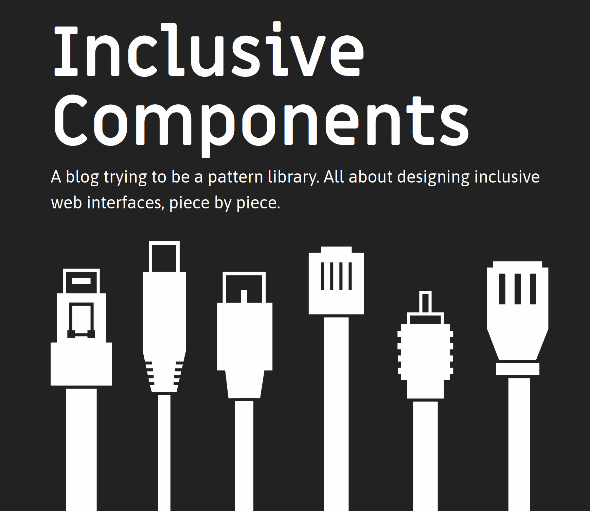
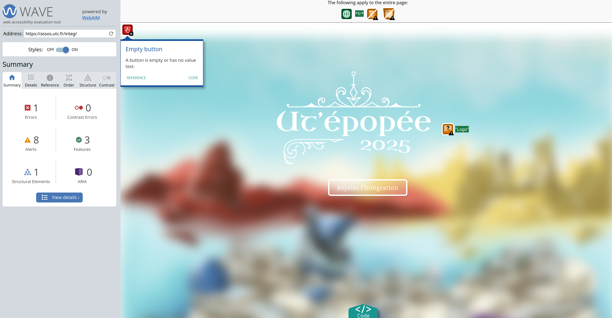

# 🕸️ Inclusive Web programming

!!! Info "In this module"
    This module provides information needed for starting implementing accessibility and inclusiveness into web development and applications.
**⛳️ Section**: *D. Programming inclusive and accessible software*

**👥 Audience**: Developers

**⏱️ ️Duration**: 10'

**📚 Prerequisites**: [👩‍💻 Inclusive code 101](D-ICO.md)

---

## When to use?
Go through this module if you work in web front-end development or on a web based framework. Please note that this module requires the trainees to follow [👩‍💻 Inclusive code 101](D-ICO.md) first.

## Disclaimer

We -the original authors- are not web developers ourselves and we haven't worked with zeb based frameworks. Therefore, this section will mostly be constituted of a hall of very useful resources on the topic. If you have experience with web-based accessibility, please feel free to [contribute](https://github.com/Page-and-Maxence/building-inclusive-open-source-software) with your expertise!

## Useful references

We selected a few resources that seemed particularly useful to get started on web accessibility and inclusiveness.

### The WCAG guidelines

We covered the WCAG guidelines multiple times at this point. They are the international reference on what to do and not do for web accessibility. If you work on web, it should be your main reference about accessibility. We especially recommend to use the [*How to Meet WCAG (Quick Reference)*](https://www.w3.org/WAI/WCAG22/quickref/) from the Web Accessibility Initiative.

### The *Inclusive Components project*

The [inclusive components project](https://inclusive-components.design/#components) should be one of your privileged resource going forward with web accessibility. It provides articles, documentation and code snippets for making elements such as collapsible sections, tooltips, toggle buttons, etc inclusive. It's truly an enormous, slid and immensely helpful work.

### Keyboard usage

#### Navigation

Navigation inside a web page or a web app is often not trivial to design. This [article](https://www.smashingmagazine.com/2022/11/guide-keyboard-accessibility-html-css-part1/) cover the basics of html and CSS accessible programming. This [one](https://medium.com/@awalakaushik/how-to-implement-keyboard-navigation-in-your-web-application-a-guide-to-web-accessibility-cb39bc27f859) seems to be a good synthesis even if we suspect it might have been written using a LLM.

You can watch [this video](https://www.youtube.com/watch?v=yV_ENQZq3fs&t=418s), to get a sense of how to test your website with a screen reader and keyboard navigation.

#### Skip to content

Most websites should include a "Skip to main content". This allows user to navigate directly to a the content of a page without going though all of the menus situated at the top of it eac time they load a new web page.

#### Heading hierarchy

This one is easy. When navigating a web page, screen readers and other assistive technologies will generate a table of content for the user using the headings.

!!! Tip
    **Therefore, breaking the hierarchy of heading, for example by skipping from a heading 2 to a heading 4 will probably brake the navigation of your webpage for assistive technologies.**

#### Menus

Designing and implementing menu is a core part of web development. This [very extensive documentation](https://inclusive-components.design/menus-menu-buttons/) provide insightful and code snippets to implement your menus in an accessible way. You could also use [this article](https://www.smashingmagazine.com/2017/11/building-accessible-menu-systems/).

#### Java Script

The article [*A Guide To Keyboard Accessibility: JavaScript*](https://www.smashingmagazine.com/2022/11/guide-keyboard-accessibility-javascript-part2/) provide detailed insights and code snippets about accessibility programming using Java Script.

### Testing softwares

#### Wave

We already covered Wave in the [🔧 Assistive technologies : Desktop](A-ITD.md) module. [Wave](https://wave.webaim.org/) is a testing software to automatically detect warnings and errors related to the [WCAG Accessibility guidelines](https://www.w3.org/WAI/standards-guidelines/wcag/). It’s as simple as entering your domain to see prevalent issues with your website.

While you might be working on a native app, it’s very likely that you or your organization have a website along with it. Wave is a very convenient way to check if you’re also up to date on that end without necessitating further knowledge.

Still be careful not to believe blindly the feedback form automated tools lke Wave. **It will often make mistakes** and is not a substitute for *savoir-faire* in any way.

#### Lighthouse

[Lighthouse](https://learn.microsoft.com/en-us/microsoft-edge/devtools/lighthouse/lighthouse-tool?source=recommendations) is a web accessibility testing software developed by Microsoft and integrated inside of Microsoft Edge. It works quite similarly to wave. You can check [Microsoft's documentation](https://learn.microsoft.com/en-ca/microsoft-edge/devtools/accessibility/lighthouse) on how to use it.

#### Axe

[Axe](https://www.deque.com/axe/) is one of the most used web accessibility tool with over two billion downloads. It's developed and maintained by Deque which are behind the accessibility of some of the biggest companies worldwide. It's feedback is very comprehensible, providing insights on how to fix specific issues and even providing information about "Best Practices".

## (Re)sources

[W3C. *How to Meet WCAG (Quick Reference)*](https://www.w3.org/WAI/WCAG22/quickref/)

[inclusive-components.design. *Inclusive components project*](https://inclusive-components.design/#components)

[Cristian Díaz. *A Guide To Keyboard Accessibility: HTML And CSS (Part 1)*](https://www.smashingmagazine.com/2022/11/guide-keyboard-accessibility-html-css-part1/)

[Kaushik A. *How to Implement Keyboard Navigation in Your Web Application: A Guide to Web Accessibility*](https://medium.com/@awalakaushik/how-to-implement-keyboard-navigation-in-your-web-application-a-guide-to-web-accessibility-cb39bc27f859)

[ExpandTheRoom. *How to Check Web Accessibility with a Screen Reader and Keyboard*](https://www.youtube.com/watch?v=yV_ENQZq3fs&t=418s)

[Heydon Pickering. *Building Accessible Menu Systems*](https://www.smashingmagazine.com/2017/11/building-accessible-menu-systems/)

[inclusive-components.design. *Menus & Menu Buttons*](https://inclusive-components.design/menus-menu-buttons/)

[Cristian Díaz. *A Guide To Keyboard Accessibility: JavaScript (Part 2)*](https://www.smashingmagazine.com/2022/11/guide-keyboard-accessibility-javascript-part2/)

[W3C. *WCAG 2 Overview*](https://www.w3.org/WAI/standards-guidelines/wcag/)

[Microsoft. *Test accessibility using Lighthouse*](https://learn.microsoft.com/en-ca/microsoft-edge/devtools/accessibility/lighthouse)

[Wave](https://wave.webaim.org/)

[Lighthouse](https://learn.microsoft.com/en-us/microsoft-edge/devtools/lighthouse/lighthouse-tool?source=recommendations)

[Axe](https://www.deque.com/axe/)